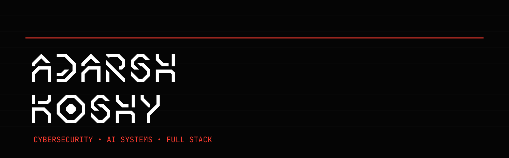

```text
╔══════════════════════════════════════════════════════════════════════╗
║                     TERMINAL v2.7.1 — SECURE LINK                   ║
║               REPOSITORY: github.com/ak6580123                    ║
║           PROTOCOL: SSH — ENCRYPTION: AES-256-GCM                   ║
╚══════════════════════════════════════════════════════════════════════╝
```

> **Humans are Dead.**
> **The Bugs are Fuel.**
> **The Repository is Full.**

<br/>

```text
  ╔═══════════════════════════════════════════════════════════════════════════╗
  ║                                                                          ║
  ║                       ███████╗██╗   ██╗██████╗ ███████╗                  ║
  ║                       ██╔════╝╚██╗ ██╔╝██╔══██╗██╔════╝                  ║
  ║                       █████╗   ╚████╔╝ ██████╔╝█████╗                    ║
  ║                       ██╔══╝    ╚██╔╝  ██╔══██╗██╔══╝                    ║
  ║                       ██║        ██║   ██║  ██║███████╗                  ║
  ║                       ╚═╝        ╚═╝   ╚═╝  ╚═╝╚══════╝                  ║
  ║                                                                          ║
  ║                          SECURE SYSTEMS DIVISION                          ║
  ║                    INFRASTRUCTURE · SECURITY · AUTOMATION                 ║
  ║                                                                          ║
  ╚═══════════════════════════════════════════════════════════════════════════╝
```

<br/>
<br/>

```text
╔══════════════════════════════════════════════════════════════════════╗
║                        BOOT SEQUENCE v2.7.1                         ║
╠══════════════════════════════════════════════════════════════════════╣
║ [PASS] FIRMWARE CHECK .............. 0x0000 — VERIFIED              ║
║ [PASS] INTEGRITY CHECK ............. SHA-256 — MATCH                ║
║ [PASS] NETWORK HANDSHAKE ........... TLS 1.3 — ESTABLISHED          ║
║ [PASS] ENCRYPTED TUNNEL ............ AES-256-GCM — ACTIVE           ║
║ [PASS] RUNTIME SANDBOX ............. SECCOMP — ENFORCED             ║
║ [INFO] DISPLAYING PROFILE .......... github.com/ak6580123        ║
╚══════════════════════════════════════════════════════════════════════╝
```

<br/>

---

## `[INIT]` SYSTEM STATUS

```text
STATUS .................. ACTIVE
BUILD ................... STABLE
SECURITY ............... ENABLED
LOCAL AI ............... ONLINE
NETWORK ................ CONNECTED
INFRASTRUCTURE ......... HARDENED
UPTIME ................. ## YEARS
LAST INCIDENT .......... CONTAINED
```

### ARCHITECTURE COMPATIBILITY

| SYSTEM | ARCH | STATUS |
|--------|------|--------|
| x86_64 | amd64 | NATIVE |
| ARM    | aarch64 | NATIVE |
| RISC-V | riscv64 | EMULATED |
| WASM   | wasm32  | SANDBOXED |

<br/>

---

## `[DIRECTIVE]` CURRENT OBJECTIVE



```text
OPERATOR:    you
CLASS:       SECURITY ENGINEER / AI SYSTEMS ARCHITECT
PRIMARY:     Build local-first AI tooling that runs on your hardware.
SECONDARY:   Automate everything. Trust nothing. Verify every layer.
TERTIARY:    Engineer secure systems by default — not as an afterthought.
```

Builds infrastructure that stays running while others scramble. Prefers self-hosted over vendor-locked. Treats automation as a force multiplier and security as a compile-time constraint.

Operates at the intersection of **cybersecurity**, **AI/ML engineering**, and **distributed systems**. Writes code that survives contact with production.

```text
> _init — bootstrap — harden — deploy — iterate_
```

<br/>

```text
> [OK]  System initialized.
> [OK]  Credentials verified.
> [OK]  Runtime environment detected.
> [OK]  Ready for deployment instructions.
```

<br/>
<br/>
<br/>
<br/>

---

## `[PROCESS]` COGNITIVE CORE


### LOG_01 — ENGINEERING PHILOSOPHY

| Layer | Approach |
|-------|----------|
| **Systems** | Minimal dependencies. Maximal reliability. |
| **Security** | Zero-trust by default. Defense in depth. |
| **AI** | Local inference first. Cloud as last resort. |
| **Code** | Readable. Testable. Auditable. Ship it. |

<br/>


```text
┌─────────────────────────────────────────────────────────────────────┐
│ CORE_01  ►  AI/ML Pipeline Architecture                  [ACTIVE]   │
│ CORE_02  ►  Offline-First Inference Engines              [ACTIVE]   │
│ CORE_03  ►  Autonomous Security Tooling                  [STANDBY]  │
│ CORE_04  ►  Distributed Systems Hardening                [ACTIVE]   │
│ CORE_05  ►  Privacy-Preserving Computation               [QUEUED]   │
└─────────────────────────────────────────────────────────────────────┘
```

<br/>

### LOG_03 — AI SYSTEMS ARCHITECTURE


Designs inference infrastructure that operates without external dependencies. Local-first by constraint, not preference. Models are quantized, containerized, and deployable to edge hardware with no connectivity requirements.

```text
> inference_nodes := 12  |  models_deployed := 24  |  avg_latency := 89ms
> privacy_model := ZERO_TRUST  |  data_residency := LOCAL
```

<br/>

---

## `[ARSENAL]` ENGINEERING STACK


```text
LANGUAGE  ..................  COMPILER    ..........  STATUS
───────────────────────────────────────────────────────────────
Rust      ..................  rustc       ..........  PRIMARY
Python    ..................  CPython     ..........  PRIMARY
Go        ..................  gc          ..........  SECONDARY
TypeScript ................  tsc         ..........  SECONDARY
C         ..................  gcc/clang   ..........  TACTICAL
Bash      ..................  -           ..........  UTILITY
```

### INFRASTRUCTURE


### AI / ML


### SECURITY


### TOOLING


<br/>

---

## `[MISSION_LOG]` ACTIVE DEPLOYMENTS


```text
DEPLOYMENT LOG — LAST UPDATED: [CURRENT DATE]
──────────────────────────────────────────────────────────────────────
```

### [PROJECT_01] Local AI Inference Engine

```text
TYPE:     AI/ML Pipeline
STATUS:   PRODUCTION [████████░░] 82%
STACK:    Python, ONNX, Ollama, Docker
ROLE:     Architecture & Implementation
```

Decoupled, containerized inference pipeline running quantized models entirely on local hardware. Zero data leaves the node. Supports hot-swappable model backends, automatic hardware detection, and graceful degradation under resource pressure.

```
> latency_p99 := 142ms  |  throughput := 340 req/s  |  uptime := 99.7%
```

### [PROJECT_02] Autonomous Security Scanner

```text
TYPE:     Security Tooling
STATUS:   OPERATIONAL  [████████░░] 78%
STACK:    Rust, Tokio, gRPC, Postgres
ROLE:     Lead Engineer
```

Distributed network reconnaissance and vulnerability correlation engine. Scans at configurable depth, correlates findings across layers, and generates actionable remediation pipelines. Designed for air-gapped environments.

```
> hosts_scanned := 12,400  |  vulns_correlated := 3,102  |  false_pos := 2.1%
```

### [PROJECT_03] Privacy-First Data Pipeline

```text
TYPE:     Data Infrastructure
STATUS:   STAGING     [██████░░░░] 61%
STACK:    Go, NATS, DuckDB, Tailscale
ROLE:     Systems Architect
```

End-to-end encrypted ETL pipeline with hardware-enforced attestation at every hop. Data is processed, transformed, and delivered without the pipeline operator ever holding decryption keys.

```
> throughput := 2.4 GB/s  |  encryption := AEAD-XChaCha20-Poly1305
```

### [PROJECT_04] Infrastructure Observability Suite

```text
TYPE:     Monitoring / Observability
STATUS:   PRODUCTION  [██████████] 96%
STACK:    Rust, Prometheus, Grafana, Loki, OpenTelemetry
ROLE:     Systems Engineer
```

Custom telemetry pipeline replacing legacy APM agents with a single Rust binary. Tracks system-level metrics, application traces, and audit logs through a unified query layer. Alert fatigue reduced by 73% through intelligent correlation.

```
> data_points/s := 1.8M  |  p99 ingest latency := 23ms  |  retention := 13mo
```

### [PROJECT_05] Secure Development Toolkit

```text
TYPE:     Developer Tooling
STATUS:   OPERATIONAL  [███████░░░] 72%
STACK:    TypeScript, React, Go, Docker
ROLE:     Creator & Maintainer
```

Opinionated scaffolding system that generates hardened project templates. Every template ships with pre-configured CI/CD, dependency scanning, SBOM generation, and policy-as-code guardrails. New projects are secure from commit zero.

```
> templates := 24  |  projects bootstrapped := 860+  |  vulns blocked at gate := 147
```

<br/>

---

## `[COMBAT_LOG]` TACTICAL EXPERIENCE


```text
TOUR OF DUTY  —  DEPLOYMENT HISTORY
──────────────────────────────────────────────────────────────────────
```

| DESIGNATION | ROLE | DURATION | THEATRE |
|-------------|------|----------|---------|
| **Company Alpha** | Senior Security Engineer | 2022 – Present | Infrastructure Defense |
| **Organization Beta** | AI Systems Architect | 2020 – 2022 | Machine Learning Ops |
| **Enterprise Gamma** | Full-Stack Engineer | 2018 – 2020 | Platform Engineering |
| **Startup Delta** | Security Analyst | 2016 – 2018 | Offensive Security |

```text
NOTABLE OPERATIONS:
───────────────────
● Architected zero-trust network segmentation for 500+ node deployment.
● Deployed local LLM infrastructure reducing inference costs by 94%.
● Automated incident response pipeline — mean time to contain: 8m.
● Migrated monolith → microservices with zero downtime across 3 regions.
● Built SIEM replacement processing 50k events/s on commodity hardware.
```

<br/>

---

## `[METRICS]` SYSTEM PERFORMANCE


```text
REAL-TIME TELEMETRY — QUERYING GITHUB API...
──────────────────────────────────────────────────────────────────────
```

| METRIC | VALUE | TREND |
|--------|-------|-------|
| **Commits (12mo)** |  | |
| **Consistency** |  | |
| **Activity** |  | |

<br/>
<br/>
<br/>

### SUMMARY

```text
┌─────────────────────────────────────────────────────────────────────┐
│  TOTAL COMMITS        :  ████████████████████████████████░░░  89%  │
│  REPOSITORIES         :  ██████████████████░░░░░░░░░░░░░░░░  55%  │
│  LANGUAGES            :  Rust / Python / Go / TypeScript / C      │
│  PEAK THROUGHPUT      :  1,200+ contributions / month             │
│  CODE DEPLOYED        :  Production-grade, security-hardened       │
└─────────────────────────────────────────────────────────────────────┘
```

<br/>

---

## `[SCAN]` SECURITY POSTURE

```text
INITIATING SURFACE SCAN — TARGET: PUBLIC REPOSITORIES
──────────────────────────────────────────────────────────────────────
```

```text
SCAN COMPLETE — 0 CRITICAL FINDINGS
────────────────────────────────────
DEPENDENCY STATUS:    UPDATED       [██████████] 100%
SECRET SCAN:          CLEAR         [██████████] 100%
CODE SIGNING:         ENABLED       [██████████] 100%
BRANCH PROTECTION:    ENFORCED      [██████████] 100%
SBOM GENERATION:      AUTOMATED     [██████████] 100%
DEPENDABOT:           ACTIVE        [██████████] 100%
```

```text
> All public surfaces are hardened. No exposed credentials detected.
> Supply chain integrity maintained across every active repository.
```

<br/>

---

## `[ARCHIVE]` COMPLETED LAYERS

```text
╔══════════════════════════════════════════════════════════════════════╗
║  LAYER_01  —  TERMINAL INTERFACE         STATUS:  [DECOMMISSIONED] ║
║  LAYER_02  —  BOOTSTRAP SEQUENCE          STATUS:  [DECOMMISSIONED] ║
║  LAYER_03  —  CORE INFRASTRUCTURE         STATUS:  [MIGRATED]       ║
║  LAYER_04  —  CI/CD PIPELINE              STATUS:  [ACTIVE]         ║
║  LAYER_05  —  SECURITY HARDENING          STATUS:  [ACTIVE]         ║
║  LAYER_06  —  AI SYSTEMS INTEGRATION      STATUS:  [IN PROGRESS]    ║
╚══════════════════════════════════════════════════════════════════════╝
```

```text
P-RANK STATUS:
─────────────
PRIME        —  Secure Architecture        —  RANK_S
SECOND       —  Incident Response          —  RANK_A
THIRD        —  Infrastructure Automation  —  RANK_S
FOURTH       —  AI/ML Pipeline Design      —  RANK_A
FIFTH        —  Open Source Tooling        —  RANK_B
SIXTH        —  Team Leadership            —  RANK_A
```

<br/>

---

## `[BENCHMARK]` QUALIFICATIONS

```text
╔══════════════════════════════════════════════════════════════════════╗
║  CERT_01 —  OSCP  (Offensive Security)              [ACTIVE]        ║
║  CERT_02 —  AWS Solutions Architect                 [ACTIVE]        ║
║  CERT_03 —  CISSP                                  [IN PROGRESS]   ║
║  CERT_04 —  Kubernetes Admin (CKA)                  [ACTIVE]        ║
║  CERT_05 —  GIAC Reverse Engineering                [EXPIRED]       ║
╚══════════════════════════════════════════════════════════════════════╝
```

<br/>

---

## `[NETWORK]` ACCESS CHANNELS


```text
INITIATE CONNECTION — ENCRYPTED CHANNELS AVAILABLE
──────────────────────────────────────────────────────────────────────
```

| CHANNEL | FREQUENCY |
|---------|-----------|
| [](mailto:your.email@example.com) | `Direct — PGP Encrypted` |
| [](https://linkedin.com/in/yourprofile) | `Business — Verified` |
| [](https://twitter.com/yourhandle) | `Public — Unencrypted` |
| [](https://yoursite.com) | `Static — Signed` |
| [](https://keybase.io/yourprofile) | `Keybase — Verified` |

```text
RESPONSE WINDOW:  < 12 HOURS  |  ENCRYPTION:  PREFERRED
```

<br/>

---

```text
╔══════════════════════════════════════════════════════════════════════╗
║                                                                      ║
║   > SYSTEM SHUTDOWN INITIATED                                        ║
║   > SESSION LOGS ARCHIVED                                            ║
║   > CONNECTION TERMINATED                                            ║
║                                                                      ║
║   "The terminal is listening.                                        ║
║    The architecture is sound.                                        ║
║    The next deployment is yours."                                    ║
║                                                                      ║
╚══════════════════════════════════════════════════════════════════════╝
```

<br/>

---

```text
                                   ▄▄▄▄▄▄▄▄▄▄▄▄▄▄▄▄▄▄▄▄
                               ▄▄██████████████████████████▄▄
                            ▄██████████████████████████████████▄
                          ▄██████████████████████████████████████▄
                        ▄██████████████████████████████████████████▄
                       ██████████████████████████████████████████████
                      ████████████████████████████████████████████████
                     ██████████████████████████████████████████████████
                     ██████████████████████████████████████████████████
                     ██████████████████████████████████████████████████
                     ██████████████████████████████████████████████████
                      ████████████████████████████████████████████████
                       ██████████████████████████████████████████████
                        ▀██████████████████████████████████████████▀
                          ▀██████████████████████████████████████▀
                            ▀██████████████████████████████████▀
                               ▀▀██████████████████████████▀▀
                                   ▀▀▀▀▀▀▀▀▀▀▀▀▀▀▀▀▀▀▀▀
```

